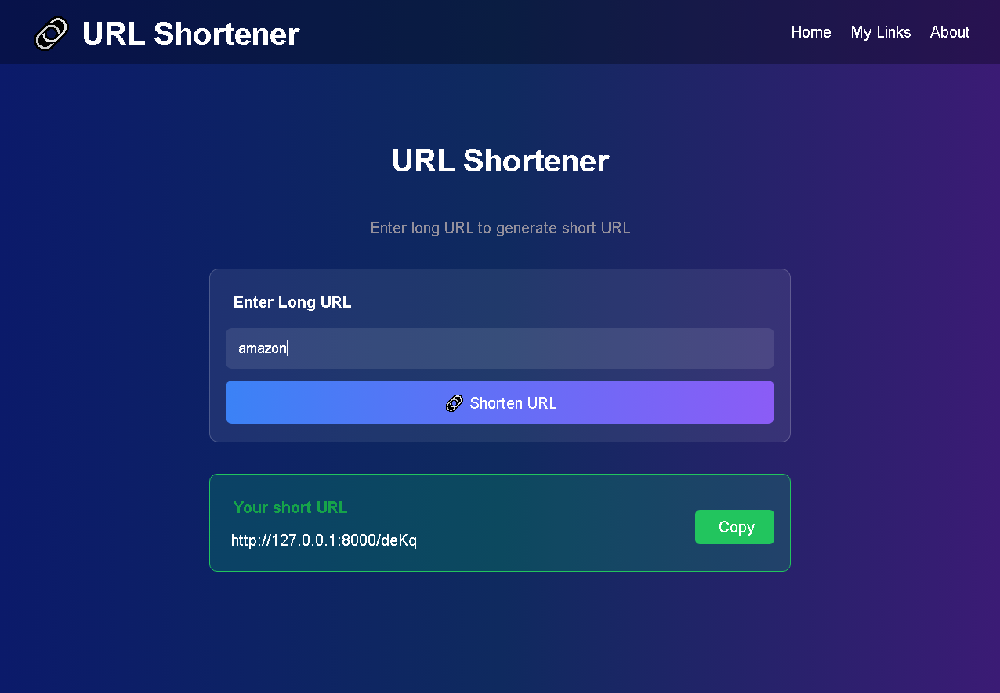
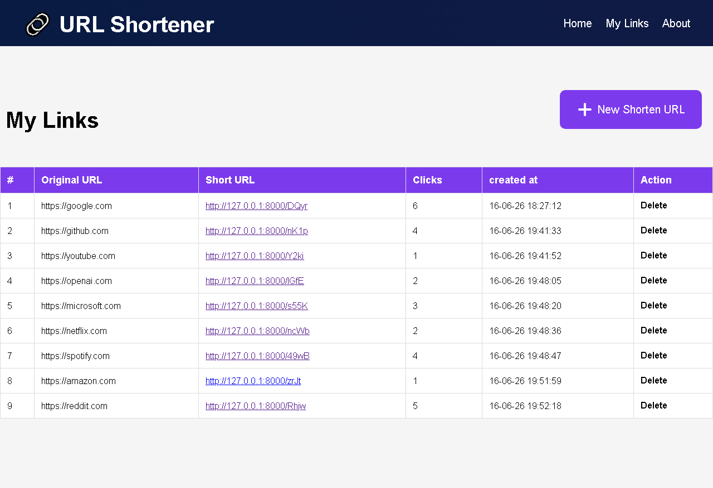

# fastapi-url-shortener 🚀

* FastLink is a simple URL shortener web application built with FastAPI.
It converts long URLs into short and easy-to-share links.

## Features

-  Create short URLs
-  Redirect short links to original URLs
-  Copy short Urls
-  Click count tracking
-  Delete short URLs
-  SQLite database storage
-  View all created links
-  FastApi backend

## Tech Stack

-  Python
-  FastAPI
-  SQLite
-  SQLAlchemy
-  HTML
-  CSS

## How to use this project?

-  Install Python on your system.

-  Run the following command in your terminal.
```
pip install -r requirements.txt


-  Clone the repository to your local system.

-  Enter into the project directory.
```
cd url_shortener


-  Create Virtual Environment by running following command.
```
python -m venv venv

-install requirements  
```
pip install -r requirements.txt


-  Run the application using following command.
```
uvicorn app:app --reload


-  Open your browser and visit:
```
http://127.0.0.1:8000


-  Hola, It's running !! 🚀

## Screenshots
home page

my link page



